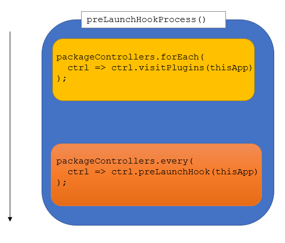

## Environment-specific configuration files
Application and Package configuration files will be looked up in the resource
path, followed by the folder that was configured with the `coon-js`-section of the 
application's _app.json_. Example (_app.json_):

```json
{
    "production": {
        "coon-js": {
            "resourcePath": "files",
            "env": "prod"
        }
    },
    "development": {
        "coon-js": {
            "resourcePath": "files",
            "env": "dev"
        }
    }
}
```

Depending on the build you are using (in this case either the production- or the development-build), 
configuration-files will be looked up in `resources/files` (note that the resources-folder is the 
folder-name/path returned by a call to `Ext.getResourcePath()`).

A _coon.js_-Application will first query configuration files for the build that is being used (by using the name
pattern `[application_name].[coon-js.env].conf.json`), and if that file could not be loaded and results in a HTTP
error-code, loading will fall back to `[application_name].conf.json`. In short, **environment-specific 
configuration files will always be given precedence over the default-configuration files**.

For using specific **package configuration files**, see the section about **[Dynamic Package Loading](#dynPackLoading)**.

## Layout of an application-configuration file 
An application’s configuration file **MUST** contain valid JSON. The configuration **MUST** be an object keyed 
under `[application_name]`. Example: For an application with the name `conjoon`, the structure needs to be 
initially laid out as follows:

```json
{
    "conjoon": {
    }
}
```

You can easily see here how the object holding future configuration has to be introduced with the name of the application, 
in this case `conjoon`.

### Sections considered within an application configuration file 
The following sections are considered when reading out a _coon.js-application_-configuration file:

 - `services`: services shared amongst modules, registered with `coon.core.ServiceProvider`
 - `application`: runtime related configuration. Will be available via `coon.core.ConfigManager.get([application_name])`
 - `plugins`: Application-/Controller-/Component-Plugins that need to be registered 
 - `packages`: Configuration for packages used by the application. Can also be used to disable/enable packages 
in a given build 
 
#### Registering Services
Configuration for services that get registered with the `coon.core.ServiceProvider` is done by providing the 
abstract under which a concrete service can be found. Both the abstract and the concrete must extend 
`coon.core.service.Service`.

The following makes sure that during runtime an instance of `coon.core.service.GravatarService` is returned
for `coon.core.ServiceProvider.get("coon.core.service.UserImageService")`. This instance is a shared instance.

```json
{
  "conjoon": {
    "services": {
      "coon.core.service.UserImageService": {
        "xclass": "coon.core.service.GravatarService",
        "args": [
          {
            "params": {
              "d": "blank"
            } 
          }
        ]
      }
    }
  }
}
```

## Dynamic Package Loading <a href="#dynPackLoading"></a> 
For dynamic package loading, _coon.js_ queries the configured environment (for Sencha Ext JS, this would be `Ext.manifest`)
for packages which are part of the `uses`-configuration in an application's _app.json_, effectively querying their _package.json_. 
In detail, _coon.js_ checks if those packages have a `coon-js`-section configured with a `package`-entry:

```json
{
    "coon-js": {
        "package": {
            "autoLoad": true
        }
    }
}
```

If `autoLoad` is set to `true`, these packages will be loaded by this application implementation dynamically upon startup.
If configured with the `registerController`-options set to true, 

```json
{
    "coon-js": {
        "package": {
            "autoLoad": {
               "registerController": true
            }
        }
    }
}
```

this package's **PackageController** - if any - will be registered with the application, and during startup, 
its `preLaunchHook`-method is called when the application is ready to settle into its `launch()`-method. 
If any of the registered PackageControllers `preLaunchHook()`-methods return `false`, the application's `launch()` will 
not be called.

## Package Configurations 
You can add individual configuration files for your packages — those files must follow the naming
scheme `[package_name].conf.json`, and it’s generally a good idea to save them in the application's _resources_-folder 
as described in the previous section (regarding the _coon.js_-environment variable `coon-js.env`), since this folder 
can serve as the root for all configuration files for your application.

Package configuration files will be considered if a package has the following section set in its _package.json_, or
globally configured in the application configuration file:

```json
{
    "coon-js": {
        "package": {
            "config": {
            }
        }
    }
}
```

or

```json
{
    "coon-js": {
        "package": {
            "config": true
        }
    }
}
```

or

```json
{
    "coon-js": {
        "package": {
            "config": "filename"
        }
    }
}
```

While the first two entries will fall back to file names matching the pattern `[package_name].conf.json`, the last example
will define the file name explicitly, loaded as additional resource to process the configuration found therein.

Using specific configuration files for packages instead of placing the configuration itself in the owning package's 
`package.json` can be beneficial when using larger configurations with packages.

If `coon-js.package.config` is configured with a `string`, it's considered to represent a file-name which is looked up 
in a package's _resource_-folder. If, however, an additional path is found in this value, this path is interpreted and resolved:

Resolving to the resource-path of the owning package (_\[owning_package\]/resources/extjs-app-webmail.conf.json_): 

```json
{
    "autoLoad": {
        "registerController": true
    },
    "config": "extjs-app-webmail.conf.json"
}
```

or (_\[owning_package\]resources/extjs-app-webmail.conf.json_)

```json
{
    "autoLoad": {
        "registerController": true
    },
    "config": "${package.resourcePath}/extjs-app-webmail.conf.json"
}
```

### Resolving to the application’s resource-path 
In the following case, configuration will be read out from the resources-folder of the application,
not the package itself. This spares developers the tedious task of looking up individual files throughout packages in
the file system; it makes it possible to have all configuration centralized at one place, maintaining this one file with 
an additional entry in _.gitignore_, if applicable.
The following resolves to `[application_root]/resources/[coon-js.resourcePath]/extjs-app-webmail.conf.json`.


```json
{
    "autoLoad": {
        "registerController": true
    },
    "config": "${coon-js.resourcePath}/extjs-app-webmail.conf.json"
}
```

Note:
**Package configuration files will completely overwrite configuration defined in the package.json-files of the owning
package.**

### Accessing Package Configuration during runtime 
The configuration’s data is registered with the `coon.core.ConfigManager` and can be queried with 
`coon.core.ConfigManager.get([package_name])`.

### Configuring Plugins for PackageControllers 
`coon.core.app.PackageController`s are application controllers that provide additional functionality for the _coon.js_-application 
they're used with, such as automizing routing or providing navigation options for their package’s views.

They can have an arbitrary number of plugins of the type `coon.core.app.plugin.ControllerPlugin` which are called by the
application during its `preLaunchHook`-process — which gets called prior to the application’s `launch()`-method.

Regardless of the state of the return-value of a PackageController's `preLaunchHook()`, all registered plugins will be
executed during the `preLaunchHookProcess`, making sure one can add additional setup instructions prior to calling a
package controller’s `preLaunchHook`.

 

_Image above:_ The `preLaunchHookProcess()` of `coon.core.app.Application` will visit every configured controller plugin first, making sure 
that calling each controller’s `preLaunchHook()` ends as soon as the first `false` is detected as a return value.

For registering PluginControllers, either create them and add them to the PackageController manually by using
`coon.core.app.PackageController#addPlugin()`, or use the package’s configuration.

#### Using the package’s name to automatically set up the plugin 
You can use the controller's owning package-name to use a **single** ControllerPlugin out of this package. The plugin will then 
be looked up in the _\[package_modern/classic_root\]app_-folder matching the naming pattern `[package-namespace].app.plugin.ControllerPlugin`, 
or by specifying the fully qualified namespace (_fqn_)of the ControllerPlugins to load.

Example:
`plug-cn_themeutil` has the namespace `coon.plugin.themeutil`; _coon.js_ tries to create
`coon.plugin.themeutil.app.plugin.ControllerPlugin` during application startup; the class must therefore be defined and
registered so the dependency can be properly resolved by Sencha Ext JS — this simply means that you need to make sure
that the owning package of the plugin is defined as a dependency for the application itself, in either the _app.json_’s
`requires` or `uses`-property.

```json
{
    "coon-js": {
        "package": {
            "config": {
                "plugins": {
                    "controller": [
                        "plug-cn_themeutil"
                    ]
                }
            }
        }
    }
}
```

The following is the same as above, but this time we specify the fqn of the plugin (`coon.plugin.themeutil.app.plugin.ControllerPlugin`)

```json
{
    "coon-js": {
        "package": {
            "config": {
                "plugins": {
                    "controller": [
                        "coon.plugin.themeutil.app.plugin.ControllerPlugin"
                    ]
                }
            }
        }
    }
}
```

### Passing arguments to a controller plugin’s constructor 
A Controller Plugin can also be configured with arguments that get applied to its constructor. For specifying constructor 
arguments, the configuration for the controller plugin has to be an object with the keys `xclass` holding the fqn of 
the controller plugin, and `args`, which is an array of arguments that get passed to the plugin’s constructor.

In the following example, `{property: "value"}` is passed as the first argument to the plugin’s constructor:

```json
{
    "coon-js": {
        "plugins": {
            "controller": [
                {
                    "xclass": "conjoon.plugin.ControllerPlugin",
                    "args": [
                        {
                            "property": "value"
                        }
                    ]
                }
            ]
        }
    }
}
```

Note: Plugins for PackageControllers will only be registered if the package uses the `coon-js.package.controller`-configuration.

You can add as many plugins as you’d like in the configuration, and mix and match package names with fqns of the
ControllerPlugins.

## Configuring Plugins for the Application 
A coon.js-application can also be configured with plugins (read: ApplicationPlugins). These plugins are coupled with the
owning application.

The configuration of application plugins follows the same principles as configuring controller plugins: resolving 
dependencies, specifying a package name or a fqn - it's all the same.

There are, however, two (obvious) differences:
 - When not using the fqn, application plugins will be looked up matching the naming pattern `[package_namespace].app.plugin.ApplicationPlugin`. 
 - ApplicationPlugins must be configured as a value of `[application_name].plugins.application`

Example:
The following registers `coon.plugin.themeutil.app.plugin.ApplicationPlugin` as an application plugin for the owning
application:

```json
{
    "conjoon": {
        "plugins": {
            "application": [
                "extjs-plug-themeutil"
            ]
        }
    }
}
```

### Configuring Component Plugins 
_coon.js_ provides funtionality to specify component-plugins using both the application- or package-configurations. To 
properly resolve component plugins as dependencies, they need to be loaded at first; either by defining them as classes 
owned by packages (e.g. by specifying those packages in the `requires`- or `uses`-section in the _app.json_) — or in 
any other way so the Ext JS’ microloader is aware of them. 
A component plugin configuration has the following key/value-pairs:

 - `cmp`: A valid component query the application can use to look up the component for which this plugin should be 
re gistered 
 - `event`: The name of the event that should be listened to for instantiating and registering the plugin 
 - `pclass`/`fclass`: The fqn for the plugin. If you are using a plugin that extends `Ext.plugin.Abstract`, 
use `pclass`. If you are referencing a grid-feature (i.e. extending `Ext.grid.feature.Feature`), use `fclass` 
 - `args`: An array of arguments the plugin's constructor gets called with 

Note: Internally, the mixin `coon.core.app.plugin.ComponentPluginMixin` is used by the `coon.core.app.Application` and
`coon.core.app.PackageController` to manage component plugins.

Example for specifying component plugins using the application configuration:

```json
{
    "conjoon": {
        "plugins": {
            "components": [
                {
                    "cmp": "cn_navport-tbar",
                    "pclass": "conjoon.ModeSwitchPlugin",
                    "event": "beforerender",
                    "args": [
                        {
                            "defaultMode": "dark"
                        }
                    ]
                },
                {
                    "cmp": "cn_mail-mailmessagegrid",
                    "fclass": "conjoon.PreviewTextLazyLoad",
                    "event": "cn_init"
                }
            ]
        }
    }
}
```

Example for specifying component plugins using a package configuration:

```json
{
    "coon-js": {
        "package": {
            "config": {
                "plugins": {
                    "controller": [
                        "plug-cn_themeutil"
                    ],
                    "components": [
                        {
                            "cmp": "cn_navport-tbar",
                            "pclass": "conjoon.ModeSwitchPlugin",
                            "event": "beforerender",
                            "args": [
                                {
                                    "defaultMode": "dark"
                                }
                            ]
                        },
                        {
                            "cmp": "cn_mail-mailmessagegrid",
                            "fclass": "conjoon.PreviewTextLazyLoad",
                            "event": "cn_init"
                        }
                    ]
                }
            }
        }
    }
}
```

## Advise on using plugins 
**Use Application Plugins** when you want to
add optional functionality to an application 
**Use Controller Plugins** when you want to
add optional functionality to a package 
**Use Component Plugins** when you want to
add optional functionality to a specific component 

## Best practices 
It is recommended to use the `packages`-section of the application configuration to make sure configuration 
can be edited at a central place. Specifying the `packages`-section in the application configuration file 
will make sure that packages configurations defined here completely overwrite the settings found in their 
original _package.json_. Configuration of packages in the application configuration is the same as
configuring packages in their associated _package.json_, except for section-keys used.

Example for package configuration in the application configuration file:

```json
{
    "conjoon": {
        "packages": {
            "extjs-app-webmail": {
                "autoLoad": {
                    "registerController": true
                },
                "config": "${coon-js.resourcePath}/mail.conf.json"
            },
            "extjs-app-imapuser": {
                "autoLoad": {
                    "registerController": true
                },
                "config": {
                    "service": {
                        "rest-imapuser": {
                            "base": "https://rest-imapuser/api/v0"
                        }
                    }
                }
            }
        }
    }
}
```